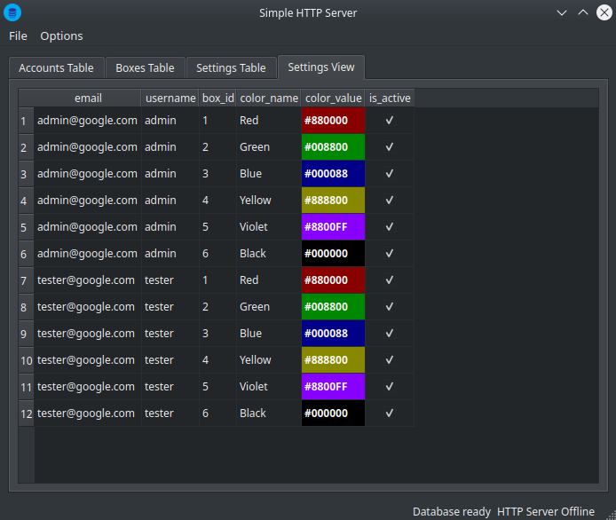

# Boxes Server

This is a desktop application for Windows 10 (x64) and Linux (x64) which can be used for playing with HTTP requests. It contains embedded SQLite database which can be explored via the desktop interface:



In order to interact with the database you need to use HTTP requests.

Binaries can be downloaded here:
- for [Windows 10 (64bit)](https://github.com/romychab/boxes-server/releases/download/v0.1/boxes-server-windows-64.exe)
- for [Linux (Ubuntu 20.04, 64bit)](https://github.com/romychab/boxes-server/releases/download/v0.1/boxes-server-linux-64.AppImage)
- If you have another OS or 32bit Windows/Linux -> you can download and compile these sources. You need to install Qt 6 in order to compile the application.

How to use:
- Launch the application
- Go to "Options" -> "Configure"
- Choose the desired IP address and port
- Press "OK"
- Now you should see "HTTP Server Online" message in the bottom status bar
- :warning: Make sure your firewall settings allows incoming requests for the app

Now you can modify the displayed content with HTTP requests:
- Create a new account:
  
  ```
  POST /sign-up

  {
    "email": "...",
    "username": "...",
    "password": "...",
  }
  ```

- Sign In (get auth token):
  
  ```
  POST /sign-in
  
  {
    "email": "...",
    "password": "..."
  }
  ```

- Get my account info:
  
  ```
  GET /me
  Authorization: {token}
  ```
  
- Update username:
  
  ```
  PUT /me
  Authorization: {token}

  {
    "username": "..."
  }
  ```
  
- Get boxes list:
  
  ```
  GET /boxes[?active=true|false]
  Authorization: {token}
  ```

  `active` - optional request argument (boolean)
  
- Get box by ID:
  
  ```
  GET /boxes/{boxId}
  Authorization: {token}
  ```

- Activate/deactive the box:
  
  ```
  PUT /boxes/{boxId}
  Authorization: {token}

  {
    "isActive": true/false
  }
  ```
  
